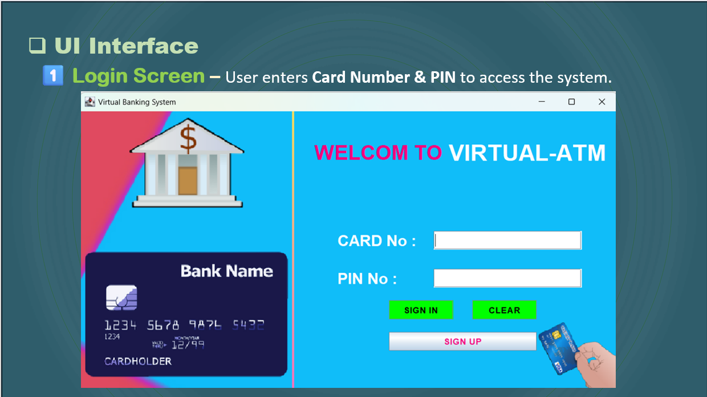
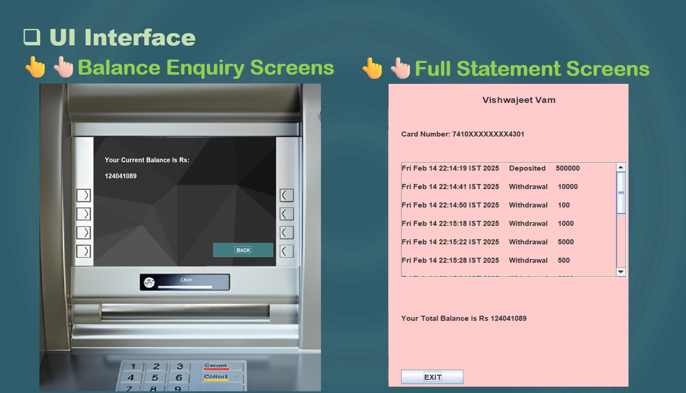

# Virtual Banking System (ATM)

A Java-based ATM simulation with cardless transactions using card number and password.

## Features
- Cardless transactions (withdraw, deposit, balance inquiry, transfer)
- Secure authentication (plain-text, planned hashing)
- UI-based menu
- Error handling for invalid inputs

## Tech Stack
- **Language**: Java Only
- **Storage**: MySQL workbench used
- **Tools**: GitHub, IntelliJ IDEA

## Installation
1. Download the ZIP from the "Code" button above.
2. Extract and open `src/` in an IDE (e.g., IntelliJ, Eclipse).
3. Run `main.java`.

## Usage
1. Enter card number (e.g., `1234567890123456`) and password (e.g., `pass123`).
2. Choose an option (1: Balance, 2: Withdraw, 3: Deposit, 4: Transfer, 5: Exit).
3. Follow prompts to complete transactions.

## Screenshots



## Project Structure
- `src/`: Java files (e.g., `main.java`)
- `docs/screenshots/`: Project images
- `resources/`: Data files (e.g., `users.txt`)

## Key Code
```java
public boolean authenticate(String cardNumber, String password) {
    User user = users.get(cardNumber);
    return user != null && user.getPassword().equals(password);
}
